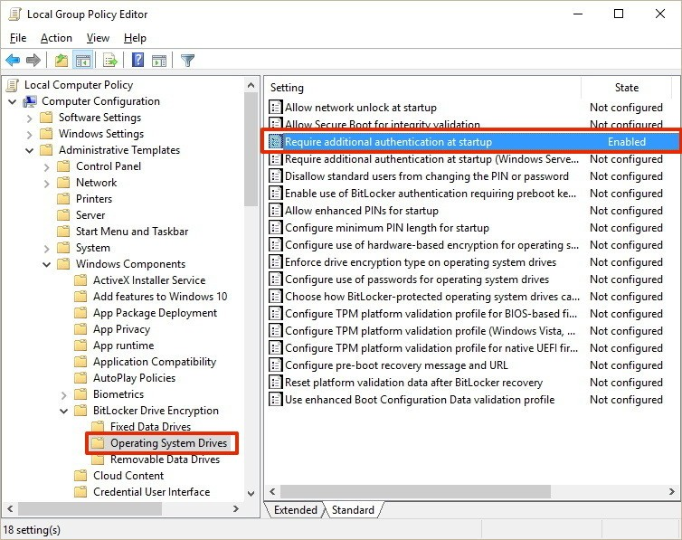
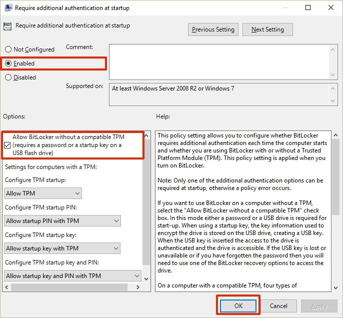

# Basics

Here are some tips for your fresh Windows 10 installation.

## BitLocker FDE

BitLocker is the Full-disk-encryption solution from Microsoft for Windows installations. A Trusted Platform Module (TPM) is required that you can enable BitLocker without any further configuration. The keys to decrypt the disk are normally stored in the TPM. They can not be extracted from this separate chip.

### Without TPM

If your mainboard does not have a TPM, you need to enter a passphrase before the system boots. This has to be enabled explicitly.

1. Use `Windows Key + R` and open `gpedit.msc`.
2. Find **Computer Configuration** > **Administrative Templates** > **Windows Components** > **BitLocker Drive Encryption** > **Operating System Drives** in the tree view on the left side of the window.
   
3. Double-click on **Require additional authentication at startup** on the right side of the window.
4. Select **Enabled** and make sure to check the **Allow BitLocker without a compatible TPM (required a password or a startup key on a USB flash drive)**. Click **OK**.
   
5. You can enable BitLocker for all drives you want.

## YubiKey Windows Login

The YubiKey can be used as a 2nd factor for user login.
For instructions please see [YubiKey Windwos Logon Configuration Guide](https://support.yubico.com/support/solutions/articles/15000006459-windows-logon-tool-configuration-guide).
